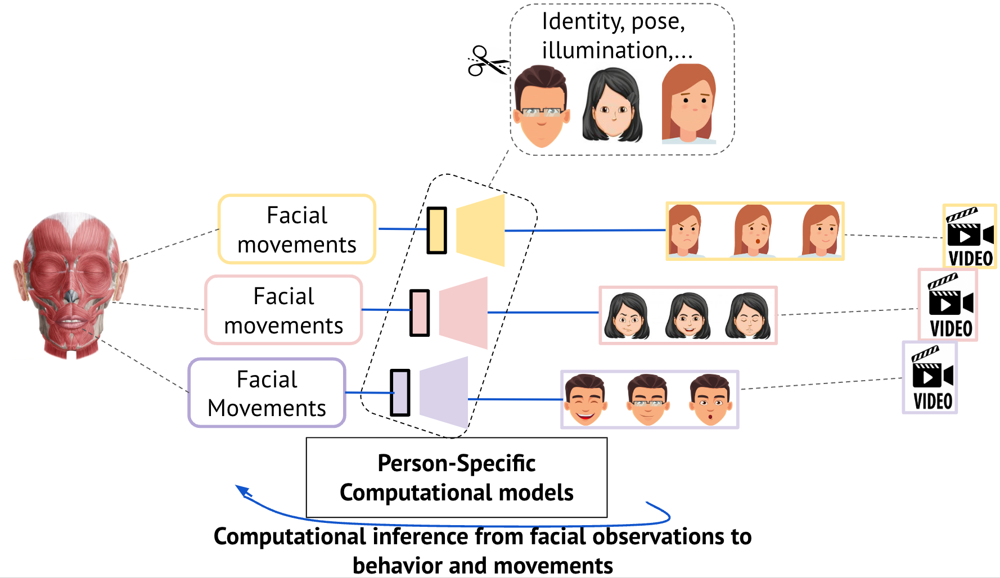

# Code accompanying: *Towards an objective characterization of an individual’s facial movements using Self-Supervised Person-Specific-Models*



## 📂 I. Repository Structure

- **`Analysis_Reproduction/`**: this directory contains the notebooks and the figures to reproduce the results of the study.

- **`Results/`**: this directory contains helper and files to reproduce the results of the study.

- **`FaceCycle/`**: this directory contains the novel training approaches for facial-motion cycle consistency introduced by Chang et al.(2021). We added PSM,GM, PSM with curriculum temporal learning, and GM with curriculum temporal learning.

-  **`FaceCycle/Training_approaches/`**:  contains the code to train the different approaches. The training options to include training approach, neutral face loss, dataset directory specification, training parameters(epochs, batch size, etc), transfer learning can easily be specified in the .yaml file. See tutorial below.

```
The repository is structured the following way:

├── Analysis_Reproduction                     <- The 2 notebooks to reproduce the results
│   ├── Analysis_Results.ipynb                <- Main results notebook
│   ├── Supplementary_Analysis.ipynb          <- Supplementary results notebook
│
├── Results                                   <- Helper files to reproduce the results
│   ├── .pickle helper files                  <- .pickle to reproduce the results
│
├── FaceCycle_with_Modifications              <- FaceCycle folder with the different training approaches
│   ├── Loss.py                               <- Loss as in Chang et al.               
│   ├── vgg19.py                              <- vgg19 as in Chang et al.  
│   ├── dataloader                            <- dataloader as in Chang et al.
│   ├── models                                <- models as in Chang et al.
│   ├── pytorch_ssim                          <- pytorch_ssim as in Chang et al.
│   ├── save_tests                            <- Folder structure where models and other files are saved after training
│   │   ├── PSM                               <- where PSM training approach will be saved
│   │   ├── PSM_wCTL                          <- where PSM_wCTL training approach will be saved
│   │   ├── GM                                <- where GM training approach will be saved
│   │   ├── GM_wCTL                           <- where GM_wCTL training approach will be saved
│   │   ├── Transfer_Learning_from_Person1    <- where Transfer_Learning_from_Person1 training approach will be saved
│   │   ├── Transfer_Learning_from_VoxCeleb   <- where Transfer_Learning_from_VoxCeleb training approach will be saved
│   ├── Training_approaches                   <- Contains code and configurations of the different training approaches
│   │   ├── Training_Approaches_Expression.py <- Code for different training approaches. Used with .yaml configuration
│   │   ├── .yaml files                       <- Different configurations 
│   │   ├── slurm_Training_script_for_hpc.sh  <- In case you use an hpc cluster and need corresponding slurm script
│
├── readme_helper.png                         <- Overview figure helper
│
└── README.md

```
## 🚀 II. Getting started with this repository

### ✏️ The code was written in Python 3.7.

### 1. Fork or clone this repository.

### 2. 🔨 Create a dedicated environment as follow with the needed dependencies.

**STEP 1:`conda create --name YOUR_ENV_NAME python=3.8 -y`**

**STEP 2:`conda activate YOUR_ENV_NAME`**

**STEP 3:`conda install pytorch torchvision torchaudio pytorch-cuda=YOUR_CUDA_VERSION -c pytorch -c nvidia`**

**STEP 4:`pip3 install matplotlib pyyaml pandas notebook seaborn numpy tabulate colorcet`**

## 💻 III. Tutorial:

### 1. Analysis Reproduction
To reproduce the analysis results, simply run the 2 notebooks: **`Analysis_Reproduction/Analysis_Results.ipynb`** and **`Analysis_Reproduction/Supplementary_Analysis.ipynb`**

### 2. Use the different training approaches on your data

#### 1. Get into the directory where the training script and the corresponding training configurations (.yaml) are.

**`% cd FaceCycle/Training_approaches`**

#### 2. Chose the training approach to use and update the configuration to match your dataset directory and where do you want the models and other files to be saved
You have many different choices and I have provided the configuration for each of them. The models are trained with GPU.
##### - Choice 1: Train a PSM. Use: training_arguments_for_PSM.yaml
**`python Training_Approaches_Expression.py --yaml_file ./Training_approaches/training_arguments_for_PSM.yaml`**
It will create one subfolder per individual selected to train in the .yaml file. If a subfolder already exists, it will create another subfolder with date and time to not overwrite.
##### - Choice 2: Train a PSM from a pretrained model from one other person. Use: training_arguments_for_PSM_Transfer_Learning.yaml
**`python Training_Approaches_Expression.py --yaml_file ./Training_approaches/training_arguments_for_PSM_Transfer_Learning.yaml`**
##### - Choice 3: Train a PSM with curriculum temporal learning. Use: training_arguments_for_PSM_wCTL.yaml
**`python Training_Approaches_Expression.py --yaml_file ./Training_approaches/training_arguments_for_PSM_wCTL.yaml`**
##### - Choice 4: Train a GM as in Chang et al. Use: training_arguments_for_GM.yaml and run:
**`python Training_Approaches_Expression.py --yaml_file ./Training_approaches/training_arguments_for_GM.yaml`**
##### - Choice 5: Train a GM from a pretrained model as in Chang et al. Use: training_arguments_for_GM_Transfer_Learning.yaml
**`python Training_Approaches_Expression.py --yaml_file ./Training_approaches/training_arguments_for_GM_Transfer_Learning.yaml`**
##### - Choice 6: Train a GM with curriculum temporal learning. Use: training_arguments_for_GM_wCTL.yaml
**`python Training_Approaches_Expression.py --yaml_file ./Training_approaches/training_arguments_for_GM_wCTL.yaml`**

## IV. 📚 Pretrained models:
Pretrained models are available to download for all the training approaches (PSM, PSMwCTL, GM, GMwCTL) for all participants in the DISFA dataset.
For PSM, there are many pretrained models to download as we effectively applied transfer learning from each participants and from VoxCeleb to each participant.
Pretrained models can be downloaded [here](https://www.dropbox.com/sh/8twdubx28mec0g6/AAA3a19L6y8YAeC47QhoEESMa?dl=0)
## 📗 V. Conclusion:
We have proposed a novel training approach for characterizing facial movements that effectively combines facial-motion cycle consistency with Person-Specific self-supervised modeling. By integrating individual differences, our approach can objectively characterize facial muscle movements without relying on human labeling. Our approach demonstrates that the model learns a representation that characterizes a fine-grained behavior specific to each person and highlights that this can not be characterized by large studies with models trained across individuals. With transfer learning, our approach is easily scalable to new persons and can generalize to new datasets. We introduced temporal curriculum learning by leveraging the temporal contiguity of the frames in a video and demonstrated that this technique helps the model learn faster.

In this paper, we take a step back to objectively characterize facial movements without relying on any human assumptions. By that means, we expect to discover novel behavioral clusters of facial movements. This has several important implications in a world where virtual reality, virtual social interactions, and human-robot interactions are sig- nificantly increasing (Metaverse, videoconferencing, etc.). By identifying representations of facial movements that are unique to healthy patients or unique to patients with neurological disorders, this paper opens a new route to identify biomarkers in facial movements for neurological or psychiatric diseases. This positions us to better understand neurological disorders and target neural mechanisms for improved diagnoses.

## 💾 VI. Data availability
The raw data is not included but was obtained from open databases: [DISFA](http://mohammadmahoor.com/disfa/) and [VoxCeleb](https://www.robots.ox.ac.uk/~vgg/data/voxceleb/).
## 📌 VII. Citations:
Any use of the code or the data should cite both the associated paper and this github repository DOI.
